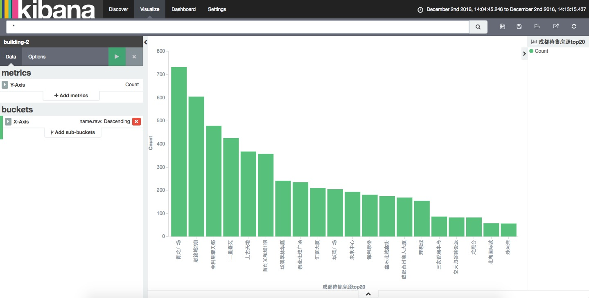

## spider

#### 一. 简介

  通过 spring boot 搭建的爬虫系统

#### 二. 技术选型

> spring boot : 搭建项目框架,比较迅速,集成嵌入式tomcat,部署运行方便,零配置代码简洁

> elasticSearch : 作为nosql数据存储引擎

> elastic-job : 分布式作业调度系统, 依赖zookeeper环境作为分布式协同

> WebMagic : 爬虫框架，有去重功能，支持Xpath、regex、css等选择器

#### 三. 运行方式

  先启动`zookeeper`和`elasticsearch` , 并修改相应配置,然后按下面任意方式启动项目

>  方式一: 执行命令`mvn spring-boot:run`即可启动

>  方式二: maven打成jar包后,将使用命令 `java -jar spider-1.0.0-SNAPSHOT.war &` 启动spider-1.0.0-SNAPSHOT.war

>  方式三: 部署在tomcat中直接运行

#### 四. 访问

    http://localhost:8080/spider?url=http://www.funi.com/loupan/region_56_0_0_0_1

#### 五. 可视化

  使用kibana关联elasticsearch, 动态展示elasticsearch存储数据, 效果图如下:

  
  

#### 六. 备注

1. [ElasticSearch搭建步骤](http://blog.csdn.net/zhengyong15984285623/article/details/52260396)
2. [Elastic-Job构建步骤](http://blog.csdn.net/zhengyong15984285623/article/details/52345931)
3. [Zookeeper使用步骤](http://blog.csdn.net/zhengyong15984285623/article/details/53323131)
4. [kibana安装](http://blog.csdn.net/zhengyong15984285623/article/details/53412925)

